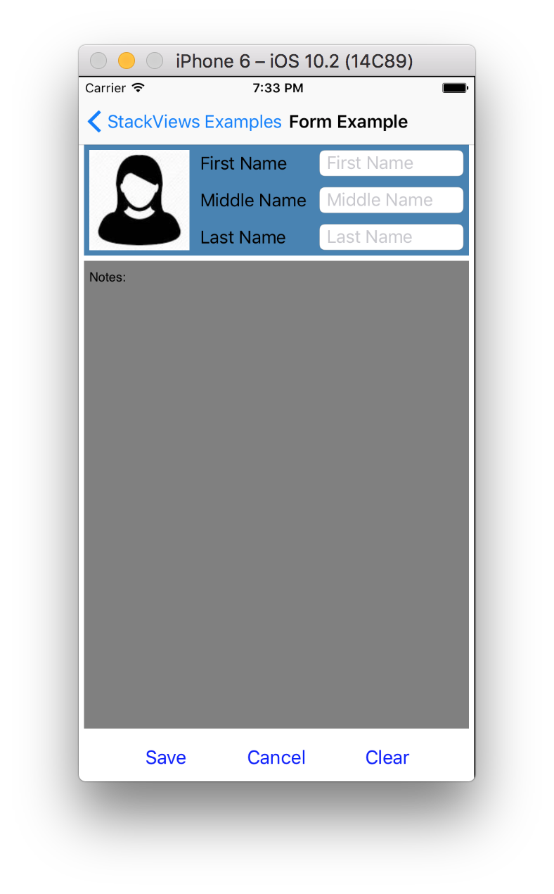
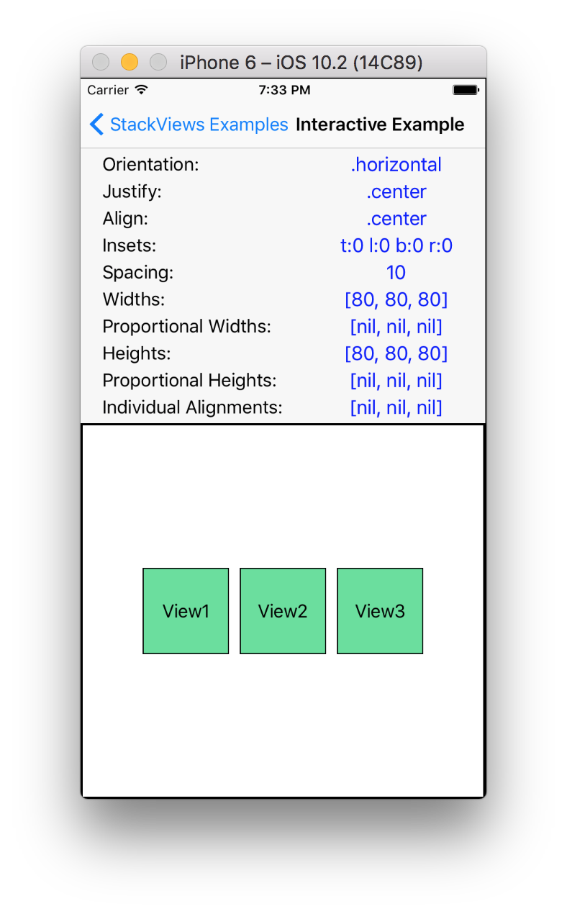
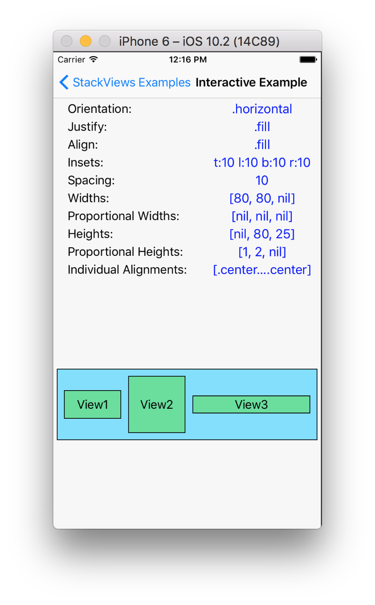

# StackViews
Small library for assigning auto layout constraints using declarative Stack View/Flex-Box semantics.

## Motivation
There are many reasons for UI Reach production strength maintainable IOS applications to lean towards code based layouting and use storyboards searingly
But programmatic constraints assignment is not very intuitive.
There are may libraries that are trying to address this issue. Some created better syntax for assigning layout constraints, some completely bypassing autolayout engine and render views using there own engine.

This library consists of one major function: *stackViews(...)* and it is trying to simplify very common scenario of stacking collection of child views in to the parent
It is similar to the IOS UIStackView but it works with any view and includes constraining of children view as a part of the same function call and has some options "borrowed" from the flex-box layout engine

Bottom line - one function call includes all the aspects of constraining children inside the StackView

## Sample application
In addition to the StackViews library workspace includes StackViewExamples reference application.
This applications uses StackView library to implement Example View Controller from Apple's [Auto Layout Cookbook](https://developer.apple.com/library/content/documentation/UserExperience/Conceptual/AutolayoutPG/LayoutUsingStackViews.html)
In addition Sample Application includes interactive view controller where different parameters of the stackViews function can be changed interactively and changes observed in the real time





## Usage Example
This is annotated code example that generates this form header ([check out source file for more details](./StackViewsExamples/StackViewsExamples/FormExapmle/FormExampleHeaderViewController.swift)):<br>

```Swift
    let image = UIImageView(image: UIImage(named: "PersonProfile"))
    let firstName = UITextField()
    let middleName = UITextField()
    let lastName = UITextField()

    //Stack Fields vertically
    let fieldsStackView = stackViews(
            orientation: .vertical, // vertical stack of 3 rows
            justify: .fill, // because heights of all 3 rows set explicitly (no nil height row) this will make
                            // fieldsStackView height determined by the sum of rows heights and spaces between them

            align: .fill,  // fill all available space across stack axis (horizontally)
            spacing: 10, //vertical spacing between rows
            views: [
                    applyLabel("First Name", ofWidth: 110, toField: firstName),
                    applyLabel("Middle Name", ofWidth: 110, toField: middleName),
                    applyLabel("Last Name", ofWidth: 110, toField: lastName)
            ],
            heights: [25, 25, 25]) // height of each row
        .container

    //set image view to be a square
    image.widthAnchor.constraint(equalTo: image.heightAnchor, multiplier: 1).isActive = true

    //Stack imageView and fieldsStackView horizontally
    //We do not set any explicit widths or heights because height of the header
    //is determined by the height of the fieldsStackView and vertical insets.
    //Height of the image is determined by the height header. Width of the image is determined by image being square
    //And width of the fieldsStackView view we want to be stretchable to fill all the available horizontal space
    _ = stackViews(
            container: self.view, // use ViewController's view as a stack container
            orientation: .horizontal, //stack image and fieldsStackView horizontally
            justify: .fill, // fill all available space along stack axis (horizontally
            align: .fill, // fill all available space across stack axis (vertically)
            insets: Insets(horizontal: 5, vertical: 5), // set space between container view boundaries and
                                                        // and it's children
            spacing: 10, // space between image and fieldsStackView
            views: [image, fieldsStackView])

```