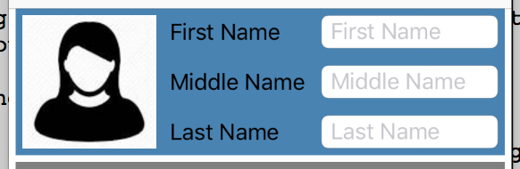

# StackViews
Small library for assigning auto layout constraints using declarative Stack View/Flex-Box semantics.

## Motivation
There are many reasons for UI Reach production strength maintainable IOS applications to lean towards code based layouting and use storyboards searingly
But programmatic constraints assignment is not very intuitive.
There are may libraries that are trying to address this issue. Some created better syntax for assigning layout constraints, some completely bypassing autolayout engine and render views using there own engine.

This library consists of one major function: *stackViews(...)* and it is trying to simplify very common scenario of stacking collection of child views in to the parent
It is similar to the IOS UIStackView but it works with any view and includes constraining of children view as a part of the same function call and has some options "borrowed" from the flex-box layout engine

Bottom line - one function call includes all the aspects of constraining children inside the StackView

## Example

Fragment that generates this form header:<br>

```Swift
    let image = UIImageView(image: UIImage(named: "PersonProfile"))
    let firstName = UITextField()
    let middleName = UITextField()
    let lastName = UITextField()

    //Stack Fields vertically
    let fieldsStackView = stackViews(
            orientation: .vertical,
            justify: .spaceBetween,
            align: .fill,
            views: [
                    applyLabel("First Name", ofWidth: 110, toField: firstName),
                    applyLabel("Middle Name", ofWidth: 110, toField: middleName),
                    applyLabel("Last Name", ofWidth: 110, toField: lastName)
            ],
            heights: [25, 25, 25])
        .container

    //Stack image and fields horizontally
    _ = stackViews(
            container: self.view,
            orientation: .horizontal,
            justify: .fill,
            align: .fill,
            insets: Insets(horizontal: 5, vertical: 5),
            spacing: 10,
            views: [image, fieldsStackView],
            widths: [100, nil])

    //set image view to be square
    image.widthAnchor.constraint(equalTo: image.heightAnchor, multiplier: 1).isActive = true

```