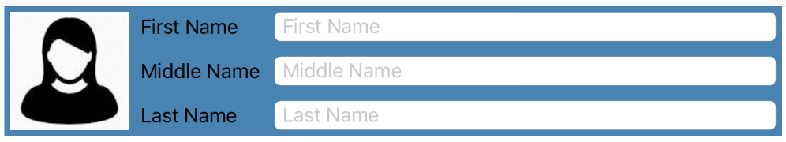

# StackViews
Small library for assigning auto layout constraints using declarative Stack View / Flex-Box semantics.

## Motivation
There are many reasons for UI Reach production strength maintainable IOS applications to lean towards code based layouting and use storyboards sparingly.
But programmatic constraints assignment is not very intuitive.
There are many libraries that are trying to address this issue. [Some](https://github.com/robb/Cartography) have more intuitive syntax for assigning layout constraints, [some](https://github.com/linkedin/LayoutKit) completely bypassing auto layout engine and render views using there own engine.

This library consists of one major function: *stackViews(...)* and it is trying to simplify very common scenario of stacking collection of child views inside the parent view. It is similar to the IOS UIStackView but strives to have few advantages:
- it treats **any** view as a stacking container
- it sets in one place **all** constraints necessary for stack layout, including dimensions and/or proportional detentions of all children, individual alignments and stack container insets
- if has additional *justify* (*distribute*) options "borrowed" from the css flex-box layout: justify-start, justify-end, justify-center

## Sample application
In addition to the StackViews library, workspace includes StackViewExamples reference application.
Reference application uses StackView library to replicate Example View Controller from Apple's [Auto Layout Cookbook](https://developer.apple.com/library/content/documentation/UserExperience/Conceptual/AutolayoutPG/LayoutUsingStackViews.html).<br>
In addition, Sample Application includes interactive view controller where different parameters of the stackViews function can be changed interactively and layout changes observed in the real time.


## Usage Example
Here is an annotated code example that generates this form header ([check out source file for more details](./StackViewsExamples/StackViewsExamples/FormExapmle/FormExampleHeaderViewController.swift)):<br>

```Swift
    let image = UIImageView(image: UIImage(named: "PersonProfile"))
    let firstName = UITextField()
    let middleName = UITextField()
    let lastName = UITextField()

    //Stack Fields vertically
    let fieldsStackView = stackViews(
            orientation: .vertical, // vertical stack of 3 rows
            justify: .fill, // because heights of all 3 rows set explicitly (no nil height row) this will make
                            // fieldsStackView height determined by the sum of rows heights and spaces between them

            align: .fill,  // fill all available space across stack axis (horizontally)
            spacing: 10, //vertical spacing between rows
            views: [
                    applyLabel("First Name", ofWidth: 110, toField: firstName),
                    applyLabel("Middle Name", ofWidth: 110, toField: middleName),
                    applyLabel("Last Name", ofWidth: 110, toField: lastName)
            ],
            heights: [25, 25, 25]) // height of each row
        .container // stackViews function returns StackingResult structure that returns generated container as one of it's properties.

    //set image view to be a square
    image.widthAnchor.constraint(equalTo: image.heightAnchor, multiplier: 1).isActive = true

    //Stack imageView and fieldsStackView horizontally
    //We do not set any explicit widths or heights because: 1)height of the header
    //is determined by the height of the fieldsStackView and vertical insets.
    //2) Height of the image is determined by the height of the header. 3) Width of the image is determined by image being square
    //4) fieldsStackView view we want to be stretched horizontally to fill all the available space
    _ = stackViews(
            container: self.view, // use ViewController's view as a stack container
            orientation: .horizontal, //stack image and fieldsStackView horizontally
            justify: .fill, // fill all available space along stack axis (horizontally
            align: .fill, // fill all available space across stack axis (vertically)
            insets: Insets(horizontal: 5, vertical: 5), // set space between container view boundaries and
                                                        // and it's children
            spacing: 10, // space between image and fieldsStackView
            views: [image, fieldsStackView])

```
## API 

Api consists of ***stackViews*** function and few small convenience functions. All public functions and types are in [StackViews.swift](./StackViews/StackViews/StackViews.swift).
```Swift
public func stackViews(
        container: UIView? = nil,
        orientation: Orientation,
        justify: Justify?,
        align: Alignment?,
        insets: Insets = Insets.zero,
        spacing: CGFloat = 0,
        views: [UIView],
        widths: [CGFloat?]? = nil,
        proportionalWidths: [CGFloat?]? = nil,
        heights: [CGFloat?]? = nil,
        proportionalHeights: [CGFloat?]? = nil,
        individualAlignments: [Alignment?]? = nil,
        activateConstrains: Bool = true) -> StackingResult
```
- **container:** Container view that acts as a stack panel.
If view is not provided a new view will be created and returned as a part of the StackingResult structure
- **orientation:** defines the stacking axes as horizontal or vertical.
- **justify:** describes the stacking option along the stacking axis.
supported options _{ **.fill .start .end .spaceBetween .center** }_
If justify parameter is set to nil no justification will be applied
- **align:** describes the stacking option across the stacking axes for all views.
supported options _{ **.fill .start .center .end** }_
Can be overwritten for specific views by the individualAlignments parameter.
If align set to nil and no individualAlignments provided - no views will be aligned
- **insets:** specify insets applied to the edges of the container view.
(Gap between the container view edges and it's children) Default = 0
- **spacing:** spacing between neighboring views along the stacking axis. Default = 0
- **views:** array of view that should be arranged (stacked) inside the container view
- **widths:** array of width values corresponding to each view in views array. nil value indicates that width constraint will not be set
If width array is provided it's length should be equal to the views array length
- **proportionalWidths:** can be used to specify relative width value for views. If bot absolute width value and relative value provided 
than the firs view with both values specified will be used as a 'key' view and all other proportionalWidths will be set in relation to this view. 
For example if we have 3 views with width: [nil, 50, nil] and proportionalWidths: [1,2,3] then resulting constraint width of the views will be: [25, 50, 75]
- **heights:** array of heights values corresponding to each view in views array. nil value indicates that height constraint will not be set
If heights array is provided it's length should be equal to the views array length
- **proportionalHeights:** can be used to specify relative height value for views. If bot absolute height value and relative value provided 
than the firs view with both values specified will be used as a 'key' view and all other proportionalHeights will be set in relation to this view.
For example if we have 3 views with height: [nil, 50, nil] and proportionalHeights: [1,2,3] then resulting constraint height of the views will be: [25, 50, 75]
- **individualAlignments:** Alignment for individual views.

## License
[MIT](./LICENSE)


   